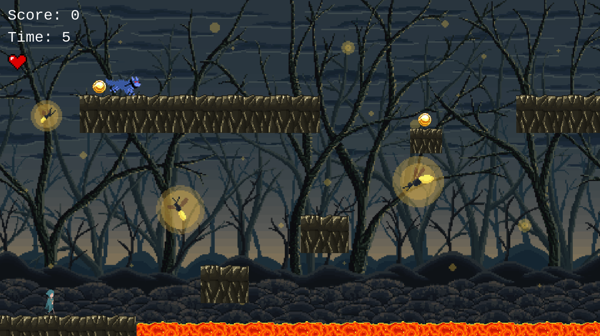
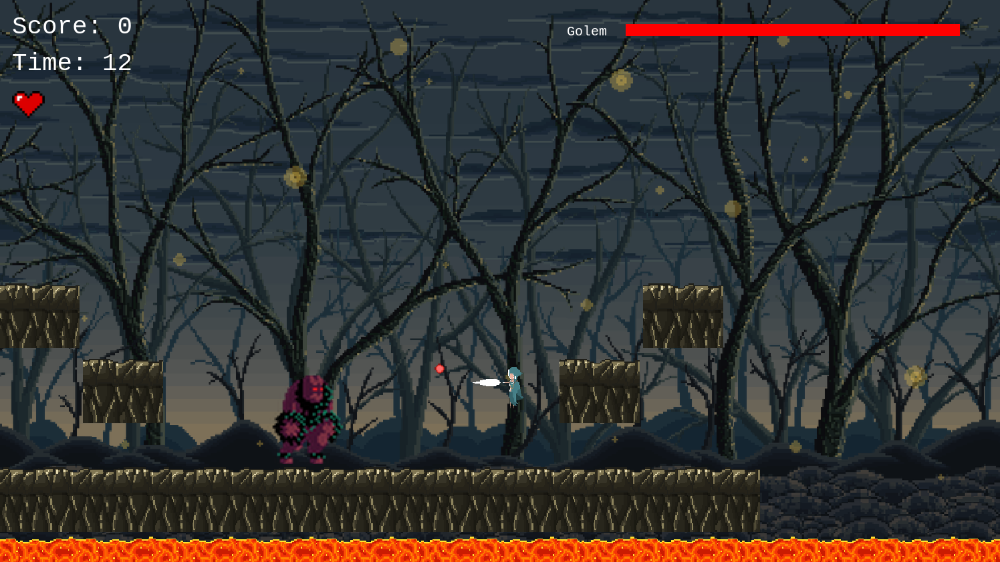

  <h1><b>IN DEN WÄLDERN</b></h1>
  <h2><b>IN THE WOODS</b></h2>

A Jump 'n Run game built with Javascript's Phaser Framework! Fight your way through the woods defying all the dangers that lurk in the dark! Overcome moving platforms, wolves and other threats and defend yourself using your magic gun! Try setting a new highscore by killing all enemies and collecting all coins as quickly as possible! Check out if you made it to the Top 10 list in the menu! Time's running - RAUS AUS DEN WÄLDERN! 
 
 
  

 

## Live Version
https://agitated-curie-05b9b2.netlify.app/

   

## Controls

  - UP: Jump
  - LEFT: Run left 
  - RIGHT: Run right (you guessed it) 
  - SPACE: Shoot right
  - A: Shoot left

## Content

<a text-align="center" href="#about">About</a>&nbsp;&nbsp;&nbsp;|&nbsp;&nbsp;&nbsp;
<a href="#ins">Controls</a>&nbsp;&nbsp;&nbsp;|&nbsp;&nbsp;&nbsp;
<a href="#ins">Installations</a>&nbsp;&nbsp;&nbsp;|&nbsp;&nbsp;&nbsp;
<a href="#usage">Usage</a>&nbsp;&nbsp;&nbsp;|&nbsp;&nbsp;&nbsp;
<a href="#app">App</a>&nbsp;&nbsp;&nbsp;|&nbsp;&nbsp;&nbsp;
<a href="#with">Built With</a>&nbsp;&nbsp;&nbsp;|&nbsp;&nbsp;&nbsp;
<a href="#author">Author</a>

## About 
This project was a task by Microverse Inc. to build a platformer game using Javascript's Phaser framework.

## 🔧 Built with

  - [x] HTML5
  - [x] CSS3
  - [x] Vanilla Javascript
  - [x] Webpack
  - [x] Phaser
  

## Usage 
To use the code in this repository, follow the steps in this section:

### 🔨 Prerequisites
 You should have the following packages installed on your computer inorder to run the code contained herein.

- Node JS 
- npm and npx

### 🔨 Setup
First get a copy of the project on your computer:

- Clone or download the repository to a local directory on your computer by following the Github instructions at [Github clone/download repository](https://docs.github.com/en/enterprise/2.13/user/articles/cloning-a-repository).

### 🛠 Installing 
Once you have a local copy of the entire project on your computer,
If you don't meet the above prerequisites, then:

- Visit [node download and installations docs](https://docs.npmjs.com/downloading-and-installing-node-js-and-npm) to install node js and npm.

###  App 
With the installations above complete, you are set to use the code and view the application built in this repository. Follow these simple steps:

- Change directory into the directory where you cloned the repository. Forexample ``vanheaven@vanheaven-VirtualBox:~/Microverse-projects$ cd phaser-game.``
- Open the index.html file using your browser

## ✒️  Authors 

👤 **Marco Erhardt**

- Github: [@marcode95](https://github.com/marcode95)
- Linkedin: [@linkedin](https://www.linkedin.com/in/marcoerhardt95/)
- Angellist: [@angellist](https://angel.co/u/marcoerhardt95)

## 👍 Show your support

Give a ⭐️ if you like this project!

## :clap: Acknowledgements
- [Character](https://hugues-laborde.itch.io/pack-character-pixel-art-02)  